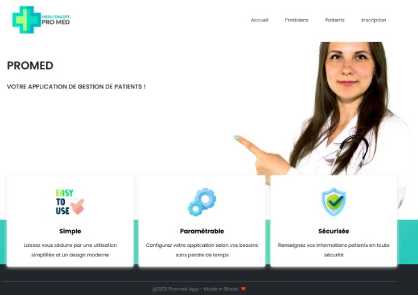

# PROMED

# Table des matières
1. [Description](#Description)
2. [Illustration](#Illustration)
    1. [Mobile](#Mobile)
    2. [Ordinateur](#Ordinateur)
3. [Langages](#Langages)
4. [Statut](#Statut)
5. [Objectif](#Objectif)
6. [Contexte](#Contexte)

##  1. Description 
Promed est un site web qui permet aux praticiens de s'insrire, de plannifier des rendez-vous pris par le client. Le client ne peut que consulter son rendez-vous. Le praticien valide ou annule le rendez-vous

## 2. Illustration 

### Mobile 

### Ordinateur 

## 3. Langages 

* HTML
* CSS3
* PHP
* MySQL

## 4. Statut 

L'application est en cours de développement.

## 5. Objectif 

 Il a pour objectif de nous faire pratiquer les langages de programmation qui a été abordé tout au long de la formation.

## 6. Contexte 

 La conception de ce projet nous permettra d'aboutir à un déveppement d'une application WEB. 