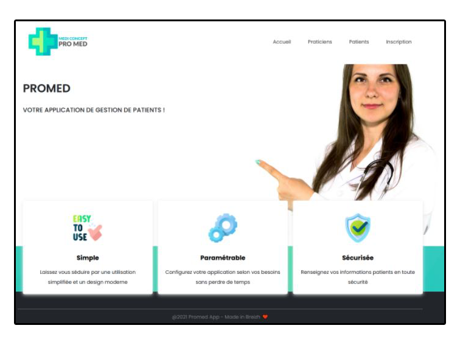
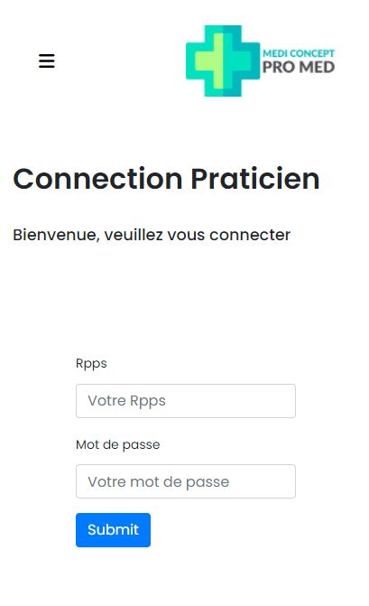

# PROMED

# Table des matières
1. [Description](#Description)
    1. [Besoin](#Besoin)
    2. [Cible](#Cible)
    3. [MVP](#MVP)
2. [Illustration](#Illustration)
    1. [Mobile](#Mobile)
    2. [Ordinateur](#Ordinateur)
3. [Objectif](#Objectif)
4. [Langages](#Langages)
    1. [Outils](#Outils)
    2. [Back](#Back)
    3. [Front](#Front)
5. [Statut](#Statut)
6. [Contexte](#Contexte)
7. [Developpeurs](#Developpeurs)
8. [Se connecter à l'application](#HowTo)

##  1. Description 
Promed est un site web qui permet aux praticiens de s'insrire, de plannifier des rendez-vous pris par le client. 

Le client ne peut que consulter son rendez-vous.
 

Le praticien valide ou annule le rendez-vous.

Nous cherchons à développer une application permettant de recenser les différentes entreprises ayant déjà accepté d’anciens stagiaires du GRETA afin de faciliter les recherches des stagiaires de l’année en cours.

Cet outil est interne au GRETA de Vannes et n'a pas vocation à servir de plateforme d'échange direct entre les entreprises et les stagiaires.
 

Il permet uniquement d’accéder à des ressources informatives.

### Besoin 
- pouvoir accéder à une base de données renfermant les informations nécessaires à la recherche d’un stage en entreprise.
- l’accès se fait via une application web.

### Cible 
l’application sera utilisée essentiellement par les stagiaires du Greta, elle pourra être également utilisée par l’ensemble du personnel administratif du Greta.

### MVP 

 #  En tant que stagiaire:

- Pouvoir se connecter sur l'application
- Pouvoir consulter la liste des entreprises
- Pouvoir consulter la fiche d'une entreprise
- Pouvoir mettre en favoris une entreprise
- Pouvoir accéder à son profil utilisateur
- Pouvoir accéder à la liste des ressources
- Pouvoir se déconnecter

##  En tant qu'admin:

- pouvoir se connecter à l'application
- Pouvoir consulter la liste des entreprises
- Pouvoir consulter la fiche d'une entreprise
- Pouvoir ajouter une nouvelle fiche entreprise
- Pouvoir inscrire un stagiaire
- Pouvoir consulter la liste des ressources
- Pouvoir se déconnecter

## 2. Illustration 

### Mobile 

### Ordinateur 

## 3. Objectif 
 
- Découvrir le langage PHP
- Mettre en place un projet Promed
- Utiliser le patron de conception MVC
- Utiliser le design pattern Singleton
- Gérer la connection avec la base de données
- Créer une application web sécurisée
 
## 4. Langages 

* 

* 

* 

* 

### Outils 

### Back 
- Visual Studio Code
- MySQL
- Google Drive(Rédaction des documents)
- Discord
- GitHub

### Front 
- Boostrap
- HTML5
- CSS3
- PHP

## 5. Statut 

L'application est en cours de développement.

## 6. Contexte 

 
Projet web réalisé dans le cadre de notre BTS SIO SLAM au Greta de Vannes. 
 Ce projet est réalisé au sein d’un groupe de 4 stagiaires.
 C’est un projet qui s’inscrit dans le parcours de formation de notre BTS SIO option SLAM, 
 promotion 2021-2022.
 
 
Chaque année un certain nombre de stagiaires ont des difficultés à trouver des entreprises pouvant les accueillir afin d'effectuer leur période de stage.
 

 ## 7. Développeurs 

 Ce projet a été conçu par :

* Aurélia - av.segarra@gmail.com
* Maxime - maximearchenoul@gmail.com
* Rémy - becart.remy@gmail.com
* Valérie - vferrand51@gmail.com

## 8. Se connecter à l'application 
### Se connecter en tant que Praticien 
    Pierre Tournesol:
		->rpps = 56253
		->mot de passe = 12345678

	Jean Raoult:
		->rpps = 23654
		->mot de passe = motDePasseTest

	Dodu Marc:
		->rpps = 564325
		->mot de psase = 87654321

### Se connecter en tant que Patient
    Fabien Bignou:
		->email = fabienBignou@test.com	
		->mot de passe = 12345678

	Ludovic Bleu:
		->email = ludovicBleu@test.com
		->mot de passe = motDePassePatient

	Julie Codeur:
		->email = julieCodeur@test.com
		->mot de passe = 87654321
