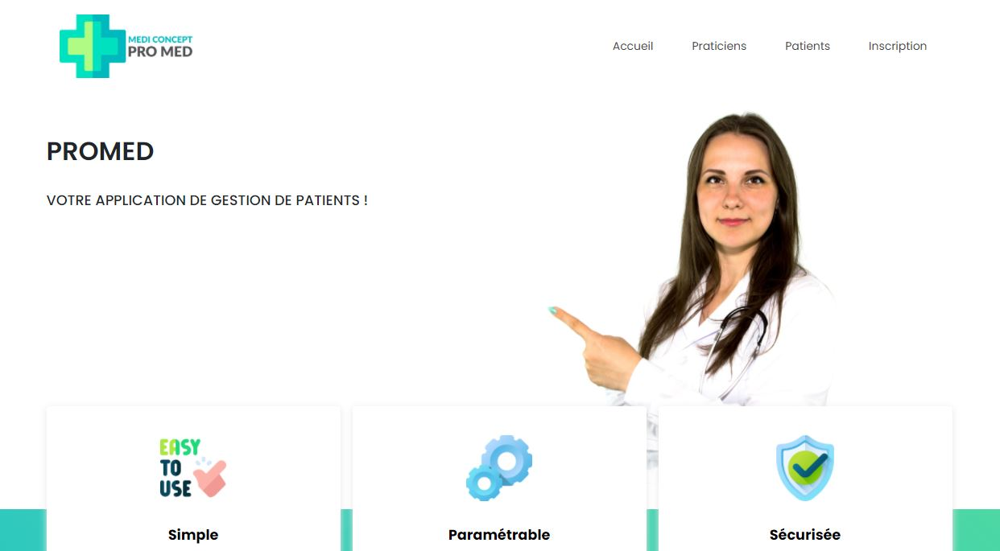

# PROMED

 

# Table des matières
1. [Illustration](#Illustration)
    1. [Mobile](#Mobile)
    2. [Ordinateur](#Ordinateur)
2. [Description](#Description)
3. [Objectif](#Objectif)
4. [Langages](#Langages)
5. [Statut](#Statut)
6. [Contexte](#Contexte)
7. [Développeurs](#Developpeurs)

## 1. Illustration 

### Mobile 

### Ordinateur 

##  2. Description 
Promed est un site web qui permet aux praticiens de s'insrire, de plannifier des rendez-vous pris par le client. Le client ne peut que consulter ses rendez-vous.

## 3. Objectif 

Il a pour objectif de nous faire pratiquer les langages de programmation qui ont été abordés tout au long de la formation.

## 4. Langages 

## 5. Statut 

L'application est en cours de développement.

## 6. Contexte 

La conception de ce projet nous permettra d'aboutir au développement d'une application WEB.

## 7. Développeurs 

Le projet à été conçu par :
* Aurélia
* Maxime
* Rémy
* Valérie